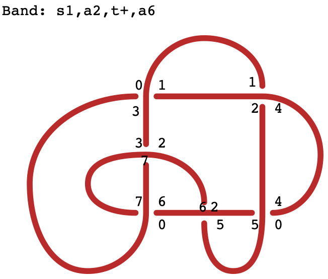

# Find ribbon bands
The python package ribbon provides code that searches for ribbon bands in knots or links. Below is an example for the first ribbon knot, the Stevedore knot.
<p align="center">

</p>


## Table of Contents
* [Features](#Features)
* [Installation](#Installation)
	* [A: I can't be bothered](#A-I-cant-be-bothered)
	* [B: Standard](#B-Standard)
* [Examples](#Examples)
	* [Python notebook](#Python-notebook)
	* [Command line tool](#Command-line-tool)
* [Output](#Output)
* [Advanced: Working directly with the compiled code](#Advanced-working-directly-with-the-compiled-code)

## Features
- Randomly tries to attach bands and simplify the resulting link until the unknot is reached, which proves that the link is ribbon
- The resulting band is (admittedly very poorly) visualized and saved to a file.
- We provide many options for customizing the search

## Installation
This guide assumes that you have a working Python 3 (version 3.8, 3.9, or 3.10) installation (and optionally Sage, if you want to use some features from snappy that require sage). It is assumed that running ```python3``` or ```sage``` works on your system and runs python 3.8 or above.  Moreover, it is assumed that you have installed git. Note that both are standard on Mac and most Linux distributions. 

*NOTE*: At the moment, the code is still closed source, which means that it ships with a Cython binary. I have compiled one version for Python 3.8-3.10 with a Macbook with an M1 chip and one with Ubuntu 22.04LTS. 

We describe the installation progress at two difficulty levels:

A: I cannot be bothered: Use that if you just want to try the code on some knot (given in terms of a PD code) and you are not familiar/comfortable with using the terminal

B: Standard: Use this if you want to know a bit more background on what the code can do and what you are actually installing

### A: I can't be bothered
1. You will need to open a terminal. On Mac, press command + space simultaneously, type terminal, and hit enter. On Linux, press Ctrl + Alt + T.

2. Check that your system meets the requirements (it usually does)
	a. If you want to use python, enter ```python3 --version``` and press enter. If the output is not ```Python 3.8``` or similar, ask someone to install python 3.8 for you. 

	b. If you want to use sage, type ```sage -v```. If the output is not  ```SageMath 9.5``` or similar, ask someone to install sage.

3. Install the package
	1. If you want to use python, copy the line below and press enter
	```console
	pip install --user git+https://github.com/ribbon/ribbon.git
	```

	2. If you want to use sage, you need to start it first by typing ```sage``` and pressing enter. Next copy the line 
	```console
	pip install git+https://github.com/ribbon/ribbon.git
	```
	and press enter. Once this is done, type ```exit``` and press enter

4. Download [this file](/examples/test_ribbon.py).

5. Run the code

	a. If you want to use python, run 
```console
python test_ribbon.py --links 'K6a3' --save-images --max-tries '-1'
```
Wait until it finds a band (it will telly you and stop), or just close the terminal window when you want to stop. You should replace 'K6a3' by the name of the knot you want to try, or by its PD code, so e.g.
```console
python test_ribbon.py --links '[[2, 0, 3, 11], [0, 7, 1, 8], [6, 1, 7, 2], [10, 4, 11, 3], [4, 10, 5, 9], [8, 6, 9, 5]]' --save-images --max-tries '-1'
```

	b. If you want to use sage, run 
```console
sage test_ribbon.py --links 'K6a3' --save-images --max-tries '-1'
```
Wait until it finds a band (it will telly you and stop), or just close the terminal window when you want to stop. You should replace 'K6a3' by the name of the knot you want to try, or by its PD code, so e.g.
```console
python test_ribbon.py --links '[[2, 0, 3, 11], [0, 7, 1, 8], [6, 1, 7, 2], [10, 4, 11, 3], [4, 10, 5, 9], [8, 6, 9, 5]]' --save-images --max-tries '-1'
```

### B: Standard
Create a new virtual environment in a terminal with

```console
python3 -m venv ~/venv-ribbon
```

Then install with pip directly from github 
```console
source ~/venv-ribbon/bin/activate
pip install --upgrade pip
pip install git+https://github.com/ribbon/ribbon.git
```

If you want to use the jupyter notebook, you need to install it and add the virtual environment as a kernel
```console
pip install jupyter notebook
python -m ipykernel install --user --name=ribbon-venv
```

Since Sage comes with python,  you can easily install the code for sage. All you need to do is run 
```console
pip install git+https://github.com/ribbon/ribbon.git
```
from within sage (either the command line interface or in a notebook).

## Examples

Once you have installed the package (either in python or sage), you are ready to use the code. We provide two examples for how to use it. One is a command line tool, and one is a (Python) notebook.


### Python notebook
If you prefer to work with an ipython notebook (either within python or sage), download and open [ribbon_example.ipynb](/examples/ribbon_example.ipynb) by running
```console
jupyter notebook ribbon_example.ipynb
```
The notebook contains the most likely use cases (search for ribbon knots using a random walk; it also shows how to easily parallelize the search to speed up finding a band for a single knot or to process multiple knots in parallel).

### Command line tool
The file [test_ribbon.py](/examples/test_ribbon.py) provides basic functionality for searching for ribbons. To see the different options available and some examples, download the file and run it with 
```python test_ribbon.py --help```

If you have Sage installed and followed the steps to install it for usage with Sage outlined above, you could run instead
```sage test_ribbon.py --help```.
Sage is only needed if you run the code with the ```--use-checks``` options, which checks the Fox-Milnor condition. This requires computing the Alexander polynomial in snappy, which in turn requires sage.

In either case, you will see the following:
```console
usage: test_ribbon.py [-h] [--file FILE] [--links [LINKS ...]] [--max-bands MAX_BANDS] [--max-size MAX_SIZE] [--max-steps MAX_STEPS] [--max-tries MAX_TRIES]
                      [--use-checks] [--save-images] [--verbose VERBOSE] [--weights WEIGHTS]

Check for ribbonness using a random walk to construct the bands. Note that all arguments should be entered in single quotes ''.

optional arguments:
  -h, --help             show this help message and exit
  --file FILE            path to file with link info to process. One line per link (can specify name, PD code, or braid word)
  --links [LINKS ...]    sequence of links, either given by their names or as a list of PD codes (separated by spaces)
  --max-bands MAX_BANDS
                         max number of bands/twists/components (we use the same upper bound for all of these instead of allowing for individual upper bounds) that should be tried to add. Default: 5
  --max-size MAX_SIZE    Maximum number of crossings. If ommited, num_crossings+1 will be used
  --max-steps MAX_STEPS  Max number of steps for each knot. Roughly, each crossed arc corresponds to one step. Default: 50
  --max-tries MAX_TRIES  Max number of resets for each knot. Set to -1 for infinite tries. Default: 1000
  --use-checks           if flag is set, will check for slice obstructions (signature, alexander poly, fox-milnor,...). This requires sage
  --save-images          if flag is set, a set of images for each ribbon knot is saved (to the same directory as this script) that shows which bands were added.
  --verbose VERBOSE      verbosity level: '0': only crucial info, '1': some info, '2': a lot of info, '3': everything (probably too much). Default: 1
  --weights WEIGHTS      specify relative probabilities for sampling the actions [start, attach, over, under, twist]. Need not be normalized to 1. Default: '[1.,17.,1.,1.,3.]', which was found to work well

Example (replace 'python3' by 'sage' at the beginning of each command to use sage instead):
    Find a band of link K6a3 (Stevedore)        : python3 test_ribbon.py --links 'K6a3' --verbose 1
    Specify some upper bounds                   : python3 test_ribbon.py --links 'K6a3' --max-bands 5 --max-size 20 --max-steps 100
    Tries each knot 10 times                    : python3 test_ribbon.py --links 'K6a3' --max-tries 10
    Check sliceness obstructions for added bands: python3 test_ribbon.py --links 'K6a3' --use-checks
    Save bands as eps files                     : python3 test_ribbon.py --links 'K6a3' --save-images
    Prioritize attach, do not twist, try forever: python3 test_ribbon.py --links 'K6a3' --weights '[1,3,1,1,0]' --max-tries '-1'
```

## Output 
Besides the text / logging output, the code can visualize the band. The algorithm works by operating on the dual graph, hence the band description is given in terms of the dual graph as well. An example output is shown in [knot plot](/assets/stevedore.png). The output will always be of the form with s# a# ... a#. Here is a short explanation for how to read the output:

* s# a#: indicates that the band is started on the strand that is crossed when going from the region indicated by the number that follows s to the region indicated by the number that follows a (these are acronyms for "start" and "attach")
* o#:    Indicates that the band is moved from the current region into the next region by crossing over the strand that is encountered
* u#:    Indicates that the band is moved from the current region into the next region by crossing under the strand that is encountered
* t+-:   Indicates that the band is twisted (either a positive or a negative twist)
* a#:    Indicates that the band is attached at the strand that is crossed when leaving the current region and entering the region indicated by the number following a

For the [example knot](/assets/stevedore.png) shown at the top of the page, this means that a band is started at the horizontal strand between regions 1 and 2, moves through region 2 where a positive twist is inserted, and then gets attached at the strand in the middle of the knot that separates regions 2 and 6.

## Advanced: Working directly with the compiled code
The main class is the RandomWalker class. At the moment, it is closed source, but we will open source it soon. It takes the following arguments:
```
Args:
    links (list)                   : list of links to check whether they are ribbon
    max_size (int)                 : maximum number of crossings
    max_steps (int)                : maximum number of steps. Roughly, each crossed arc corresponds to one step.
    max_bct (int)                  : max number of twists, or components, or number of bands that we allow before for a knot (note that bands and components are correlated if the starting object is a knot)
    logger (logging.logger)        : logger to print info. If None, a logger will be created
    use_band_checks (bool)         : Set to True to check some known obstructions to sliceness after adding a band. Note this can be slower than omitting this step for large knots since some knot invariants (like the Alexander Polynomial) are quite computationally expensive.
    save_solved_knot_images (bool) : Set to True to save images that illustrate the bands (for verification).
Returns:
    A new RandomWalker class instance
```
From this class, you essentially only need the ```invalid_action_mask()``` and ```step(action)``` methods. The former returns a list, which contains a 1 for actions that are valid in the current state and a 0 for actions that are invalid. You can then choose randomly (or in an informed way, if you know which band you want to construct) an action and perform it using the ```step``` method. The step function expects an integer indicating the action and will return a bool indicating whether it is resetting the knot. The reason for the reset (if any) is given in the second argument.
